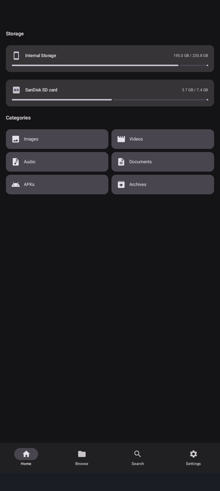
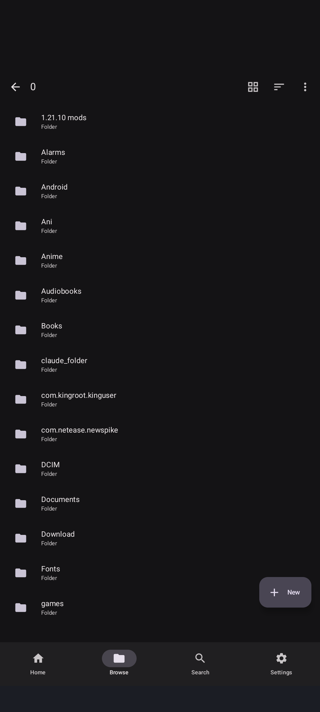
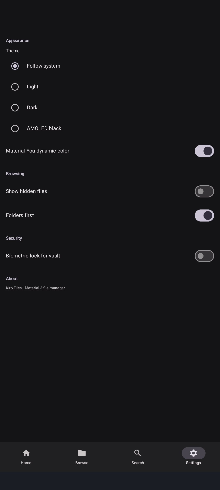
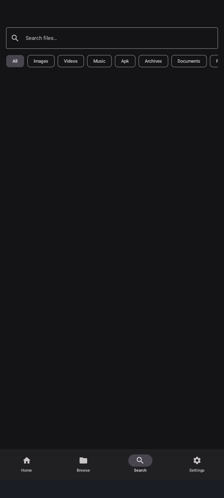

# Kiro Files

A modern Android file manager built with Jetpack Compose. Browse, search, and manage files across your device with category shortcuts, media previews, archive handling, and optional root / Shizuku power features.

<p align="center">
  <a href="https://github.com/Dreamucxe/FileManager/raw/main/releases/FileManager-release.apk">
    
  </a>
</p>

> Tap the button above to download the signed release APK directly, or grab it from [`releases/FileManager-release.apk`](releases/FileManager-release.apk).

## Screenshots

<p align="center">
  
  
  
  
</p>

## Features

- **Category browsing** — home-screen chips for Images, Videos, Audio, Documents, APKs, and Archives open a filtered view of every matching file on your device.
- **Search** — fast filename search with type filters.
- **Media previews** — inline image, video, and audio handling.
- **Text viewer** — open and read text files in-app.
- **Archives** — browse and extract archive contents.
- **APK inspector** — view details of installed and stored APKs.
- **Indexing** — background file indexing for quick results.
- **Power features** — optional root and [Shizuku](https://shizuku.rikka.app/) support for elevated file access.

## Install

1. Download the APK using the button above.
2. On your device, enable **Install unknown apps** for your browser or file manager if prompted.
3. Open the APK and tap **Install**.

Minimum Android version: **10 (API 29)**. Target: **Android 14 (API 34)**.

## Build from source

```bash
git clone https://github.com/Dreamucxe/FileManager.git
cd FileManager
./gradlew assembleDebug
```

The debug APK will be at `app/build/outputs/apk/debug/app-debug.apk`.

> **Note:** The release signing keystore is intentionally **not** included in this repo. Building the `release` variant requires your own `kiro-release.jks` and `keystore.properties`. The prebuilt signed release APK is available in [`releases/`](releases/).

## Tech stack

- Kotlin + Jetpack Compose
- Hilt (dependency injection)
- KSP (annotation processing)
- Coroutines / Flow

## License

No license specified yet. All rights reserved by the author unless a license is added.
